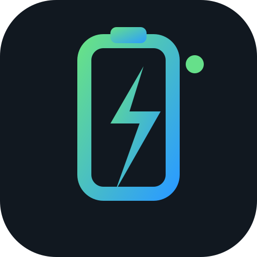
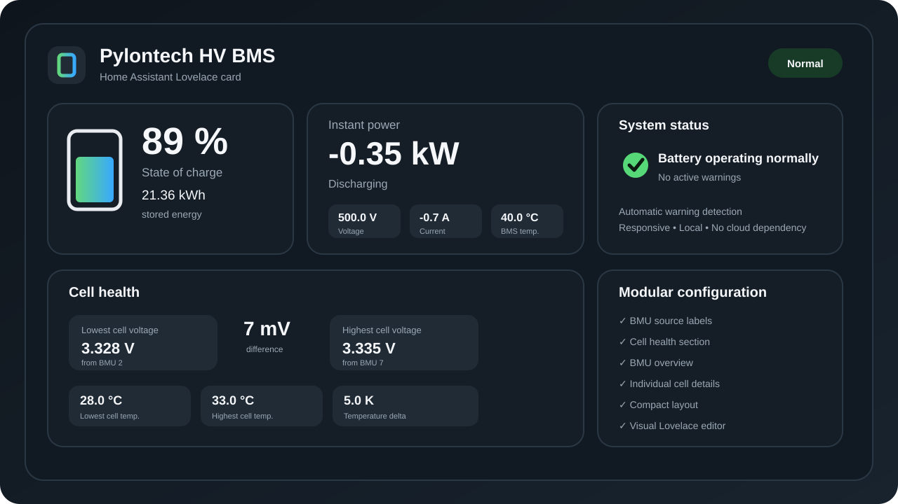

<p align="center">
  
</p>

<h1 align="center">Pylontech HV Card</h1>

<p align="center">
  A modern Lovelace card for Pylontech high-voltage battery systems in Home Assistant.
</p>

<p align="center">
  
  
  
  
</p>

<p align="center">
  Designed for the
  <a href="https://github.com/BlueIceWolf/home-assistant-pylontech-hv">Pylontech HV BMS integration</a>.
</p>



## Overview

Pylontech HV Card gives you a clean overview of the important values from your high-voltage battery without filling a dashboard with dozens of separate entities.

Setup is intentionally simple: **select any entity belonging to your Pylontech HV BMS** and the card automatically discovers the related pack, BMU, cell and warning entities.

## Features

- State of charge
- Stored energy
- Battery voltage and current
- Live charge / discharge power
- Optional BMS vs. inverter power comparison
- BMS temperature
- Lowest and highest cell voltage
- Cell voltage difference
- Lowest and highest cell temperature
- Cell temperature difference
- Optional BMU source for min / max values
- Integrated warning state
- Optional BMU overview
- Optional individual cell overview
- Responsive layout using container queries
- Compact mode for narrow dashboard columns
- Visual Lovelace editor
- Automatic entity discovery
- Home Assistant theme support
- No Mushroom dependency required
- Local operation — no cloud service required by the card

## Requirements

- Home Assistant
- [Pylontech HV BMS for Home Assistant](https://github.com/BlueIceWolf/home-assistant-pylontech-hv)

The companion integration currently targets Pylontech HV systems such as the **SC0500 / XHB_CMU_H7** family and exposes pack, BMU, cell and diagnostic entities.

## Installation

### HACS

1. Open **HACS**.
2. Go to **Frontend** / **Dashboard**.
3. Add this repository as a **Custom repository**.
4. Select **Dashboard** as the repository type.
5. Install **Pylontech HV Card**.
6. Reload Home Assistant or refresh the browser.

Repository:

```text
https://github.com/BlueIceWolf/pylontech-hv-card
```

## Quick start

Add the card through the Lovelace UI and select **any entity from your Pylontech HV BMS**.

Or use YAML:

```yaml
type: custom:pylontech-hv-card
entity: sensor.pylontech_bms_charge_ah
```

The selected entity is only used as an anchor. The card automatically finds the other entities belonging to the same Pylontech HV system.

## Example configuration

```yaml
type: custom:pylontech-hv-card
entity: sensor.pylontech_bms_charge_ah
name: Pylontech HV BMS

show_modules: true
show_cells: false
show_diagnostics: true
show_source_bmu: true

show_header_icon: true
show_energy: true
show_cell_health: true
compact: false
```

## Configuration options

| Option | Default | Description |
| --- | --- | --- |
| `entity` | required | Any entity belonging to the Pylontech HV BMS |
| `name` | `Pylontech HV BMS` | Card title |
| `show_modules` | `true` | Show expandable BMU overview |
| `show_cells` | `false` | Show expandable individual cell voltages |
| `show_diagnostics` | `true` | Show system status and warnings |
| `show_source_bmu` | `true` | Show which BMU provides min / max cell values |
| `show_header_icon` | `true` | Show battery icon in the card header |
| `show_energy` | `true` | Show stored energy below state of charge |
| `show_cell_health` | `true` | Show the cell health section |
| `show_power_comparison` | `true` | Show the optional BMS vs. external power comparison when configured |
| `compact` | `false` | Reduce padding and card height for compact dashboards |

## Automatic discovery

You do **not** need to configure every sensor manually.

The card uses the selected entity to identify the matching Pylontech integration instance and automatically discovers available values such as:

- SoC
- voltage
- current
- power
- BMS temperature
- cell voltage min / max
- cell temperature min / max
- warning sensors
- BMU values
- individual cell voltages

This also makes the card much easier to reuse across different Home Assistant installations.

## BMU source information

When `show_source_bmu` is enabled, the card can display where an extreme value comes from.

Example:

```text
3.328 V
Lowest cell voltage
from BMU 2
```

The same applies to highest cell voltage and minimum / maximum cell temperature.

## Responsive design

The card automatically adapts to its actual Lovelace column width rather than only the browser width.

On narrow dashboards, sections stack vertically and metric tiles resize to remain readable.

For especially small layouts, enable:

```yaml
compact: true
```

## Companion integration

This card is developed alongside:

**[BlueIceWolf/home-assistant-pylontech-hv](https://github.com/BlueIceWolf/home-assistant-pylontech-hv)**

For the best experience, use both projects together.

## Issues and feedback

If you find a bug or have an idea for another metric or layout option, please open an issue on GitHub.

When reporting a display issue, it is helpful to include:

- Home Assistant version
- card version
- screenshot
- dashboard column width / device type
- which Pylontech HV hardware is being used

## License

MIT


### BMS warnings and balancing maintenance

The card distinguishes between **real BMS warning/error states** and diagnostic measurements such as cell-voltage spread. Cell delta is shown as a measurement and no longer creates a red BMS alarm by itself.

With integration v1.0.2 or newer, the card also shows the balancing-maintenance state. Pylontech Force-H2 documentation recommends a periodic full charge for balancing; the integration records observed full charges and recommends another after 90 days.


## Optional power comparison

With Pylontech HV BMS integration v1.0.3 or newer, the card automatically displays the optional external-power comparison when it is configured in the integration.

It shows BMS power, external battery power, power difference and the estimated power ratio. The comparison can be hidden in the visual card editor. The value is diagnostic and is not presented as a guaranteed inverter efficiency.
